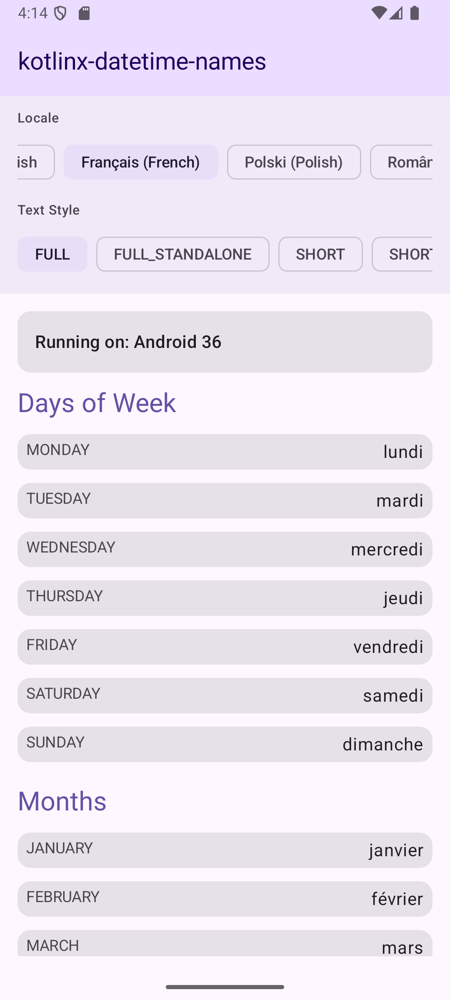
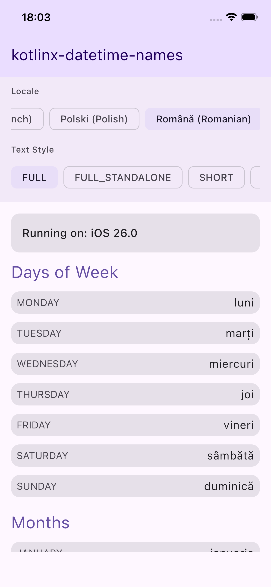

# kotlinx-datetime-names

[](https://central.sonatype.com/artifact/io.github.adrcotfas/kotlinx-datetime-names)
[](https://opensource.org/licenses/Apache-2.0)

A Kotlin Multiplatform library that provides localized display names for [kotlinx-datetime](https://github.com/Kotlin/kotlinx-datetime) types.

## What is it?

This library extends `kotlinx-datetime` by adding extension functions to get localized display names for `DayOfWeek` and `Month` enums. It supports multiple text styles (FULL, SHORT, NARROW) and uses platform-specific localization APIs to provide accurate, locale-aware formatting.

## Supported Platforms

- **Android** (API 21+)
- **iOS** (iOS 11+)
- **JVM** (Java 11+)

## Installation

### Gradle (Kotlin DSL)

```kotlin
dependencies {
    implementation("io.github.adrcotfas:kotlinx-datetime-names:0.1.0")
}
```

### Gradle (Groovy DSL)

```gradle
dependencies {
    implementation 'io.github.adrcotfas:kotlinx-datetime-names:0.1.0'
}
```

## Usage

### Basic Usage

```kotlin
import io.github.adrcotfas.datetime.names.*
import kotlinx.datetime.DayOfWeek
import kotlinx.datetime.Month

// Get localized day names
val monday = DayOfWeek.MONDAY
println(monday.getDisplayName()) // "Monday" (or localized equivalent)

// Get localized month names
val january = Month.JANUARY
println(january.getDisplayName()) // "January" (or localized equivalent)
```

### Advanced Usage with Locale and Text Style

```kotlin
import io.github.adrcotfas.datetime.names.*
import kotlinx.datetime.DayOfWeek
import kotlinx.datetime.Month

// Specify locale and text style
val locale = java.util.Locale.GERMAN // or platform-specific locale
val day = DayOfWeek.MONDAY

// Full name
println(day.getDisplayName(TextStyle.FULL, locale)) // "Montag"

// Short name
println(day.getDisplayName(TextStyle.SHORT, locale)) // "Mo"

// Narrow name
println(day.getDisplayName(TextStyle.NARROW, locale)) // "M"
```

### Available Text Styles

- `TextStyle.FULL` - Full display name (e.g., "Monday", "January")
- `TextStyle.FULL_STANDALONE` - Full standalone name
- `TextStyle.SHORT` - Short display name (e.g., "Mon", "Jan")
- `TextStyle.SHORT_STANDALONE` - Short standalone name
- `TextStyle.NARROW` - Narrow name (e.g., "M", "J")
- `TextStyle.NARROW_STANDALONE` - Narrow standalone name

## Demo

 

The library includes a demo app that showcases localized names across different locales and text styles.

## License

This project is licensed under the Apache License 2.0 - see the [LICENSE](LICENSE) file for details.
